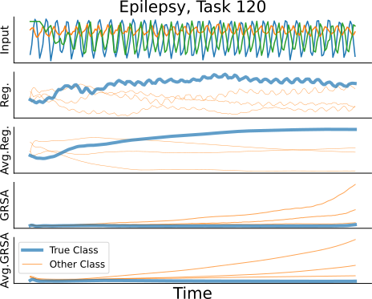
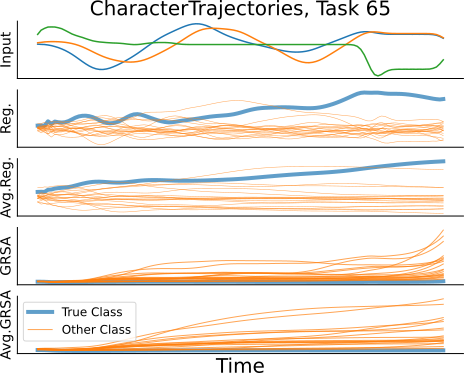
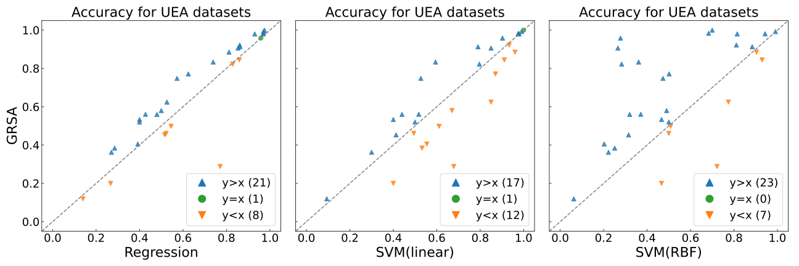

# Online classification of multivariate time series data through Gaussian Reservoir State Analysis (GRSA)

## Paper
under review

## Architecture


## Demonstration of Online Time Series Classification

| |   |
|:--:|:--:
|*Epilepsy, Task 120.*|*CharacterTrajectories, Task65.* |   


## Experimental Highlights (UCR Dataset)



# Getting Started

## Prerequisites

- Install Python 3.8 or higher.

- Install dependencies:

```bash
pip install -r requirements.txt
```

## Data Preparation

1. Download time-series anomaly detection benchmark datasets following (https://github.com/elisejiuqizhang/TS-AD-Datasets).

2. Organize data:
Place datasets in `benchmarks/{dataset_name}/data`.

## Running the Code

Run the main script with your chosen options:

```bash
python main.py --benchmark UCR --method MDRS
```

- Supported benchmarks: `UCR, SMD, SMAP, MSL, PSM, SWaT`

- Methods: `SPE, TRAKR, MDRS, MDSW_fixed, MDSW_adjusted`

## Results

- Results are saved in `results` and `plots` directories within each benchmark folder.
- Runtime analysis is stored in `analysis` directory within each benchmark folder.


# Details (Under Review)


## Gaussian Reservoir State Analysis (GRSA)


# Main Results

## Overall Results


