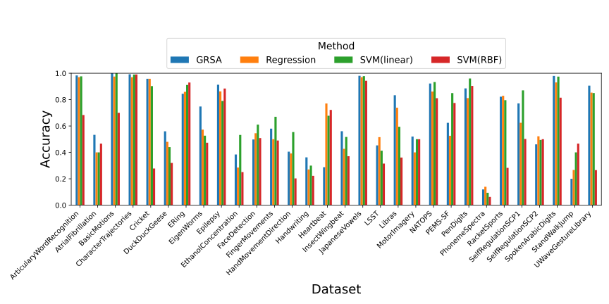
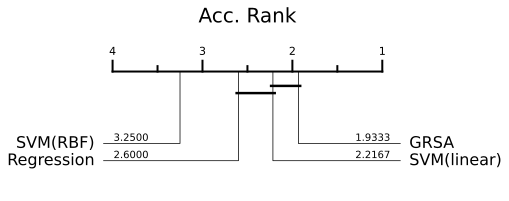
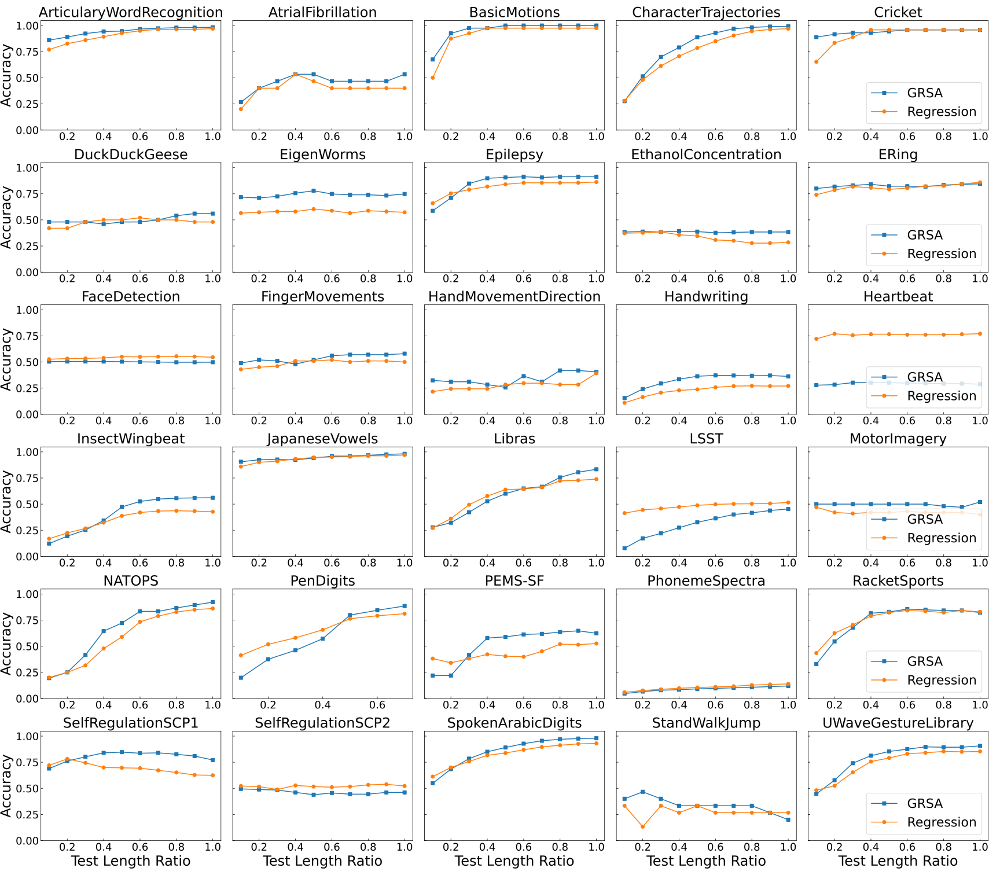

# Gaussian Reservoir State Analysis (GRSA)

## Paper
Under review

## Architecture


## Demonstration of Online Time Series Classification (Regression vs. GRSA)

| |   |
|:--:|:--:
|*Epilepsy, Task 120.*|*CharacterTrajectories, Task65.* |   


## Experimental Highlights (UCR Dataset)


# Getting Started

## Prerequisites

- Install Python 3.8 or higher.

- Install dependencies:

```bash
pip install -r requirements.txt
```

## Running the Code

Run the main script:

```bash
python main.py
```


## Results

- Performance analysis is stored in `analysis` directory within each benchmark folder.
- Model outputs for Regression or GRSA are saved in `results` directory within each benchmark folder.


# Main Results

## Overall Results






## Potential for Early Classification




